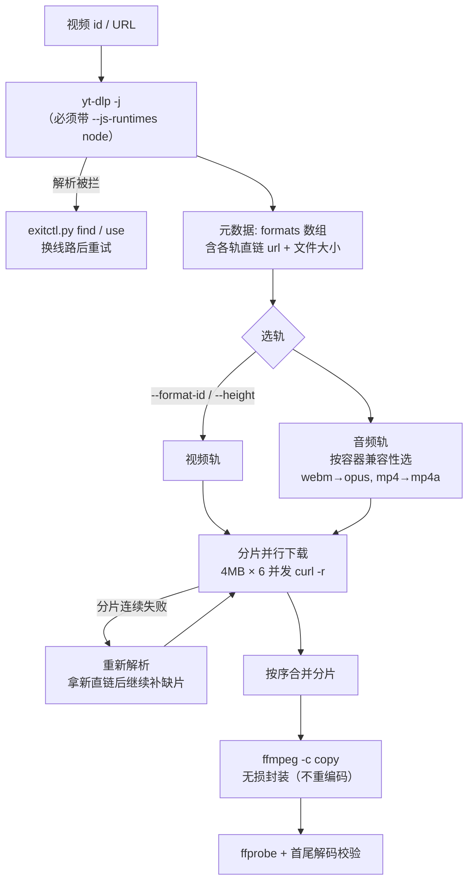

# youtube-toolkit

> 高速下载 YouTube 视频的**大文件分片下载器** —— 支持 4K / 10-bit HDR 原片（单文件 7~12 GB）。
> 核心做法：自己取直链，把文件切成小片、多连接并行拉取，再按序合并 + 无损封装 + 自动校验。
>
> **本 README 同时是给 AI Agent 的操作手册。** 如果你是被指派来完成「下载某个 YouTube 视频」「排查下载慢 / 403 / 解析被拦」的 AI，请直接跳到 [§5 给 AI 的操作契约](#5-给-ai-的操作契约)，那里有可直接执行的命令与症状→动作映射表。

---

## 1. 它解决什么问题

用 `yt-dlp` 自带的下载器拉大文件，会稳定踩到三类坑。它们**表面上都像"网络问题"，根因却完全不同**：

| 症状 | 容易被误判为 | 真实根因 |
|---|---|---|
| 下载只有 **10~30 KB/s** | 网络差 / 该换线路 | 源站对**单条连接**只给一段开头突发带宽，之后主动限速 |
| `HTTP 403 Forbidden` | 被墙了 / 需要 cookie | 直链**有效期很短**（几十分钟），且与签发时的请求上下文绑定 |
| `Sign in to confirm you're not a bot` | 需要登录 / 需要 cookie | **请求来源 IP** 被源站标记，与 cookie 无关 |

三类我们都实测复现并定位过（数据见 [§4](#4-关键机制与实测数据)），本工具围绕它们设计。

---

## 2. 架构设计

### 2.1 组件

```
youtube-toolkit/
├── ytdl.py        # 主体：解析 → 选轨 → 分片并行下载 → 无损封装 → 校验
├── exitctl.py     # 可选辅助：多线路环境下逐条测速与切换
├── requirements.txt
└── README.md
```

两个脚本职责严格分离，**不互相 import**：

- `ytdl.py` 只管「给我一个视频标识，把片下下来」。
- `exitctl.py` 只管「当前网络环境通不通、哪条线路能用」；它不关心你在下什么。

这样拆分的原因：**线路会随时失效**（实测中有一条线路在推完 11.5 GB 后彻底不可用）。把「换线路」做成独立工具，故障时人工或 Agent 只需跑一条命令，不必改动或重启下载器。

### 2.2 数据流



### 2.3 四个关键设计决策

| 决策 | 替代方案 | 为什么这么选 |
|---|---|---|
| **自己取直链、自己拉流** | `yt-dlp -f 337 URL` | yt-dlp 下载器对多数直链返回 403，但**同一 URL 用 curl 请求是 206**。直链是好的，是下载器的问题 |
| **切片 + 多连接并行**（4 MB × 6） | 单连接 + 断线重连 | 重连只能解决"断流"，**解决不了"限速"**。切片让每个新连接都重新吃到突发带宽，实测提速约 300× |
| **用 curl 子进程**，不用 Python `requests` | `requests.get(stream=True)` | 代码复杂度相近，但 curl 自带 `-C -`（续传）、`--retry-all-errors`、`--speed-limit`（卡死判定） |
| **分片独立落盘 + 按序合并** | 单文件 append | 任一片失败只需重下该片；中断重跑自动跳过已有片；合并顺序由文件名（起始 offset）保证 |

### 2.4 选轨规则（重要，错了会白下一整部片）

- YouTube 的 4K **只有 vp9 / av01，没有 H.264**（H.264 最高 1080p）。
- 音频必须与视频**容器**兼容，否则 `ffmpeg -c copy` 会在**下载完成之后**才失败：
  - `webm` 容器只接受 Vorbis / Opus → 优先选 `opus`
  - `mp4` 容器只接受 AAC → 优先选 `mp4a`
  - 不确定 → 封装阶段自动退回 `.mkv`（万能容器）兜底
- 常见 format id 参考（随视频不同）：

| id | 编码 | 说明 |
|---|---|---|
| `313` | vp9 8-bit | 体积最小，兼容性相对最好 |
| `337` | vp9.2 **10-bit** | 体积最大；**Safari 完全播不了**，用 IINA / VLC |
| `701` | av01 (AV1) | 压缩率最高；Apple M1/M2 无 AV1 硬解，更卡 |

---

## 3. 环境依赖

| 依赖 | 用途 | 必需 |
|---|---|---|
| Python ≥ 3.10 | 运行脚本 | ✅ |
| `yt-dlp` | 解析元数据与直链 | ✅ |
| `curl` | 分片拉流（macOS / Linux 自带） | ✅ |
| **Node.js** | yt-dlp 解 YouTube 的 JS 签名挑战 | ✅ **缺了必然报「确认你不是机器人」** |
| `ffmpeg` / `ffprobe` | 封装与校验（可用 `static-ffmpeg` 免安装） | ✅ |

```bash
python -m venv .venv && source .venv/bin/activate
pip install -r requirements.txt
python ytdl.py --check        # 一键自检：逐项报告 + 实测目标站连通性
```

外部程序支持**环境变量覆盖**，找不到时也会在常见安装路径里自动搜索：

```
YT_YTDLP / YT_NODE / YT_FFMPEG   # 指定可执行文件路径
```

---

## 4. 关键机制与实测数据

以下数字均为同一台机器、同一段网络环境、同一条直链上实测，是本项目全部设计的依据：

| 实验 | 结果 |
|---|---|
| 单连接持续下载 | **~10 KB/s** ❌ |
| 连续 4 MB 独立分片 | **3.0 ~ 6.5 MB/s** ✅ |
| Cloudflare CDN 对照（验证链路本身） | **13.8 MB/s** ✅ |
| 拉取 11.5 GB 完整 4K 原片 | 单连接会在 ~5 分钟后死于 `IncompleteRead`（约 13% 处）；改分片后一次跑完 |

**结论：慢 ≠ 线路烂。遇到龟速先怀疑连接数，不要先怀疑线路。**

配套的两条铁律：

1. **直链与请求上下文绑定。** URL 里含来源标记（`ip=<来源IP>`），所以**解析和下载要在同一个网络环境下进行**；中途改变网络环境，旧直链立刻 403。
2. **"网页能打开" ≠ "yt-dlp 能解析"。** 风控拦的是解析请求，必须用 `yt-dlp -j` 实测。（实测中 40 条线路里 35 条能打开 YouTube 网页，但只有 3 条能成功解析。）

---

## 5. 给 AI 的操作契约

### 5.1 标准流程（按序执行）

```bash
# ① 自检：确认 yt-dlp / node / ffmpeg / curl 都在，且目标站可达
python ytdl.py --check

# ② 确认视频标识。用户给 URL 就原样用，给短链先展开
#    支持：https://youtu.be/<id>、https://www.youtube.com/watch?v=<id>、裸 id

# ③ 先看有哪些格式，拿到 title / 时长 / 各档体积，避免下错档
python ytdl.py --list <id>

# ④ 按用户意图选档并下载
python ytdl.py <id> --format-id 337      # 用户要"最大的" / "4K 原片"
python ytdl.py <id> --height 2160        # 用户要"4K"但不指定具体档
python ytdl.py <id> --height 1080        # 用户要"能直接用/能播"（H.264，兼容性最好）
python ytdl.py <id> --audio-only         # 只要音频

# ⑤ 产物默认落 ~/Downloads/，命令末尾会打印 ffprobe 摘要 + 首尾解码结论
```

### 5.2 症状 → 动作映射表

| 症状 / 报错 | 根因 | AI 应该做什么 |
|---|---|---|
| `Sign in to confirm you're not a bot` | 当前来源 IP 被源站标记 | 换一个网络环境 / 线路后重跑。**不要尝试用 cookie 或登录去解，方向错了** |
| `HTTP 403 Forbidden` | 直链过期，或中途换过网络环境 | 直接重跑同一条命令。分片已落盘，只会补缺失部分，不会重下 |
| 速度持续 < 100 KB/s | 退回单连接了 | 检查 `--workers` 是否被改小；确认没有改用 `yt-dlp` 原生下载器 |
| `IncompleteRead` / `ChunkedEncodingError` | 单条长连接被掐断 | 本项目已内置分片，正常不会出现；若出现说明被改回单连接 |
| 解析很慢（>30s）但最终成功 | JS 挑战（node 在解） | 正常，等待即可 |
| `没有找到 node` | 环境缺 Node.js | 装 Node，或用 `YT_NODE=<绝对路径>` 指定 |
| 产物在 Safari 打不开 | 4K 是 VP9/AV1 | 改用 IINA / VLC；或重下 `--height 1080` 拿 H.264 |
| 磁盘不足 | 4K 原片 7~12 GB | 下载前 `df -h` 确认，或改 `--out-dir` |

### 5.3 Do / Don't

**Do**

- 先 `--check` 再动手，一次成本换掉后面所有玄学排查。
- 用户说"4K / 最大的"就下 `337` 或 `--height 2160`；用户说"能播就行"就下 `--height 1080`。
- 交付时**明确告知产物编码**（例如 "VP9 Profile 2 10-bit，用 IINA/VLC 播，Safari 不支持"）。
- 相信内置校验：默认会跑 `ffprobe` + 首尾解码，失败会返回非 0 退出码。

**Don't**

- ❌ 不要用 `yt-dlp -f <id> <url>` 直接下（403）。
- ❌ 不要在下载过程中改变网络环境（直链与请求上下文绑定，会 403）。
- ❌ 不要把"慢"当成"线路问题"去反复换线路 —— 先看连接数。
- ❌ 不要在没跑 `--list` 的情况下猜 format id。
- ❌ 不要把 `exitctl.py` 读到的口令提交到任何地方（它只从本地配置实时读取，不落盘）。

---

## 6. 命令参考

### ytdl.py

| 参数 | 说明 |
|---|---|
| `target` | YouTube URL 或 video id |
| `--format-id <id>` | 直接指定视频轨（如 `337`），优先级最高 |
| `--height <n>` | 视频轨分辨率上限，自动挑该档内码率最高者 |
| `--audio-only` | 只要音频（输出 `opus` / `m4a`） |
| `--out-dir <dir>` | 输出目录，默认 `~/Downloads` |
| `--name <str>` | 输出文件名（不含扩展名） |
| `--workers <n>` | 并发连接数，默认 6 |
| `--chunk-mb <n>` | 分片大小 MB，默认 4 |
| `--no-verify` | 跳过下载后校验 |
| `--list` | 只列格式后退出 |
| `--check` | 只做环境自检后退出 |

产物路径：`<out-dir>/<标题> [<video id>].<ext>`；中间件在 `<out-dir>/.<video id>.parts/`（成功后自动清理）。

### exitctl.py（可选，多线路环境才需要）

| 命令 | 说明 |
|---|---|
| `groups` | 列出所有分组及当前生效线路 |
| `test [--group G]` | 测当前线路对 `--url`（默认 YouTube）的延迟 |
| `find [--group G] [--threads N] [--url U]` | 遍历组内线路逐条测速，按延迟排序输出可用线路 |
| `use "<线路名>" [--group G]` | 切换线路 |

配置优先级：命令行 `--api/--secret` → 环境变量 `EXITCTL_API/EXITCTL_SECRET` → 配置文件 `~/.config/exitctl.json`：

```json
{"api": "http://127.0.0.1:<端口>", "secret": "<口令>"}
```

> 适用于任何提供同构控制接口的本地方案（接口路径 `/proxies`，鉴权 `Authorization: Bearer <口令>`）。

---

## 7. 已知限制

- 依赖目标站的现行行为。若其调整限速或风控策略，§4 的参数（分片大小 / 并发数）需要重新实测标定。
- 不做播放列表（显式传 `--no-playlist`）；不做字幕；不做重新编码。
- 未处理需要登录（年龄限制 / 会员）的视频。
- 大文件下载占满磁盘前不会预警，请自行 `df -h`。

## License

[MIT](LICENSE)
